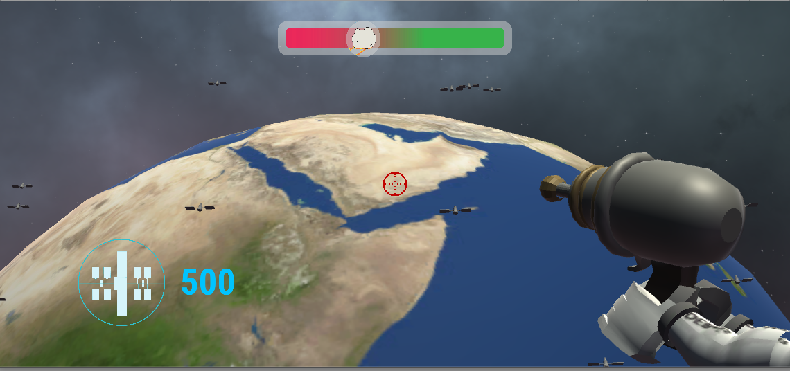
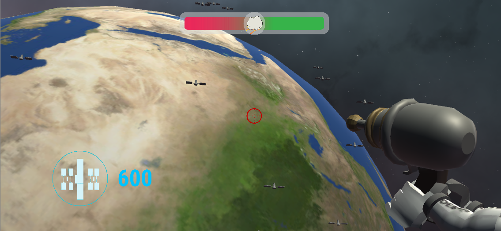
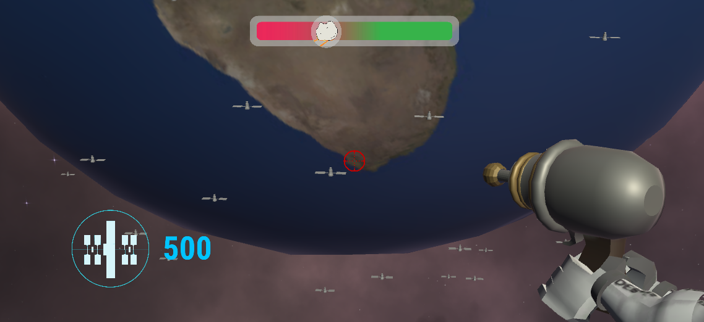
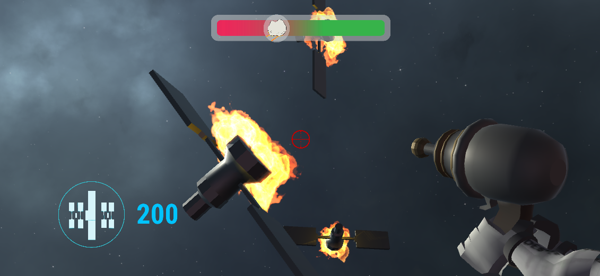
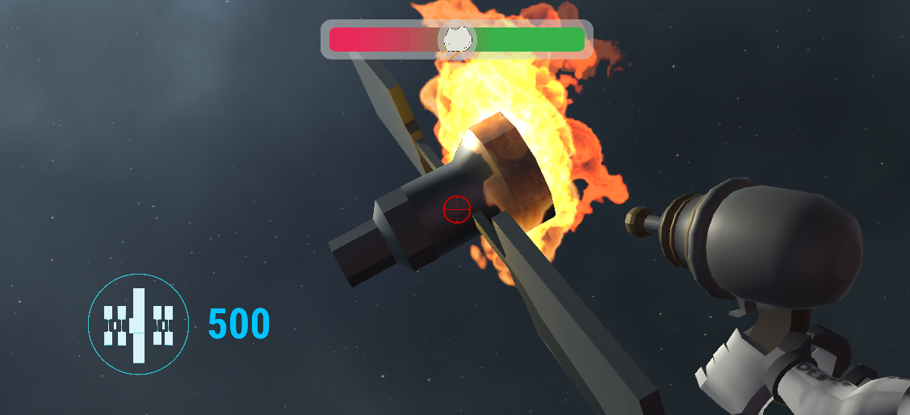
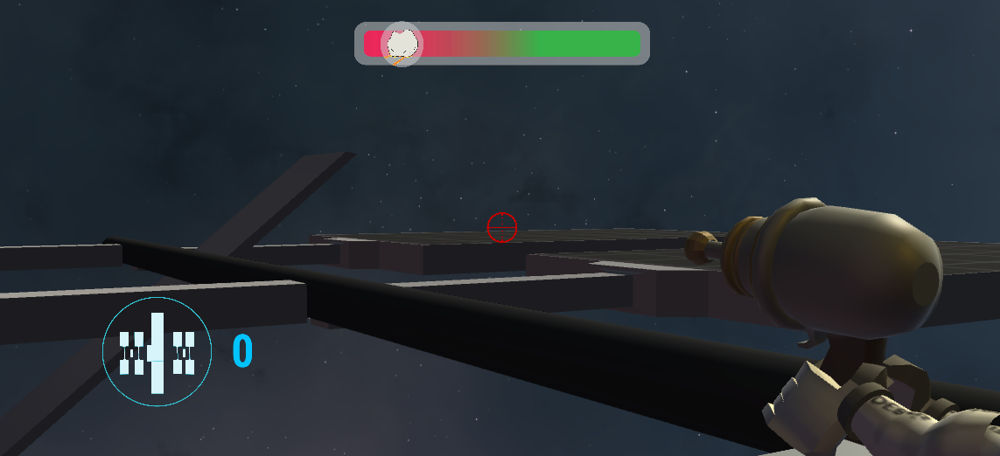
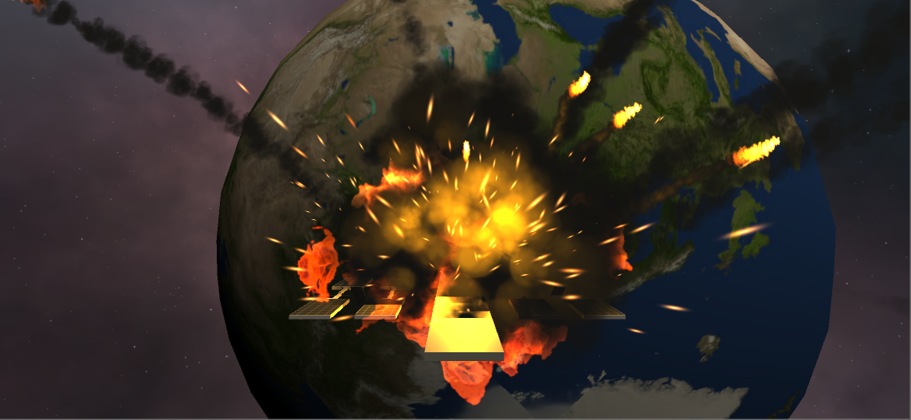
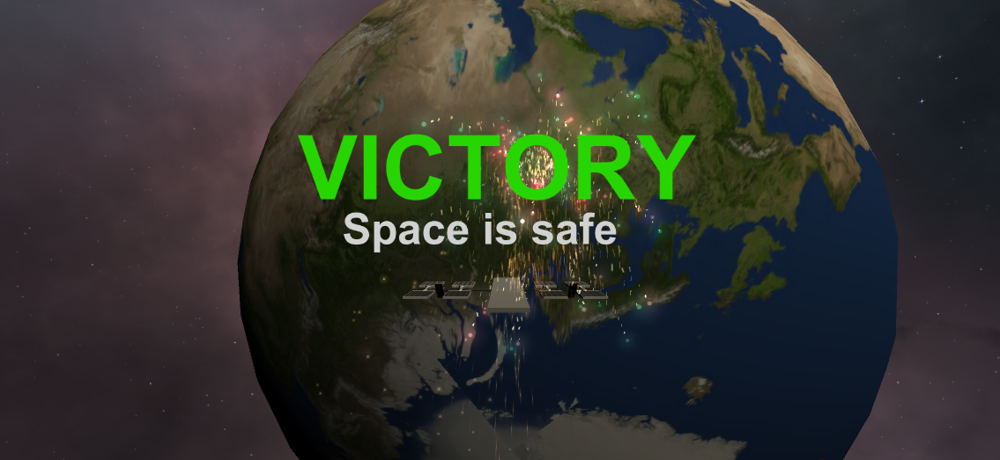

# Debris Hunters Game
## Overview
[My Team's Offical NASA Project Page](https://2019.spaceappschallenge.org/challenges/stars/orbital-scrap-metal-the-video-game/teams/the-debris-hunters/project) includes the specific challenge, overview of my team's project, references, and languages/software used. 
<!-- and [playable alpha version] (https://www.debrishunters.co/)! -->

NORAD satellite debris data first modelled in my [Python prototype](https://github.com/robertnester/space-debris-sim) is used to render satellite debris in Earth's orbit which can be seen in the gameplay screenshots below.

## Gameplay

